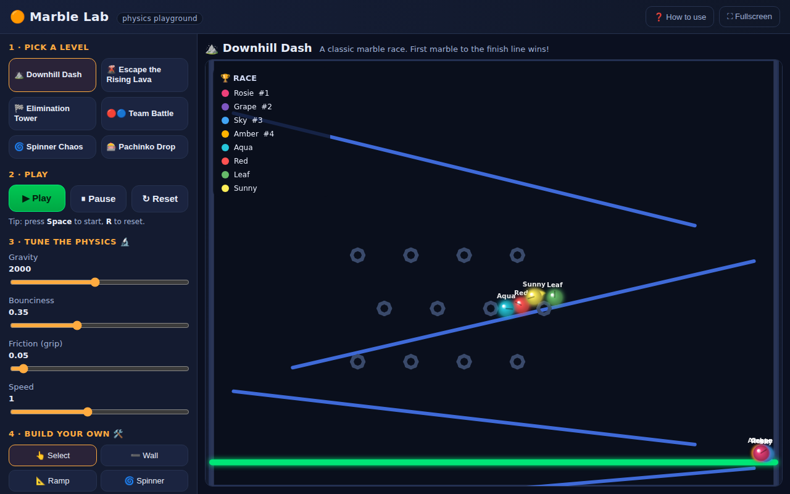

# 🟠 Marble Lab — a MIKAN-style physics simulator

A friendly, browser-based **2D physics playground** for making marble-race and
survival videos in the style of the YouTuber **MIKAN**. Built so a curious,
mathematically-inclined **10-year-old** can open it and start experimenting —
no installation, no accounts, no internet required.

> Just open **`index.html`** in any web browser. That's it.



---

## What is MIKAN and why this exists

[**MIKAN**](https://www.youtube.com/@mikan2d) is a Japanese creator (~2.2M
subscribers) who makes hugely popular **marble physics** videos. The signature
ingredients of his style:

- **Colorful marbles with glowing fading "tracer" trails** rolling down tracks.
- **Survival modes** — escape rising lava, dodge spinning blades and crushers.
- **Elimination & team battles** — last marble (or team) standing, with a live
  leaderboard.
- Marbles **move only by physics** (gravity, bouncing, friction) — they can't
  drive themselves. The drama comes from chaos + hazards + music.

He builds these in **Algodoo**, a real 2D physics sandbox. Algodoo is powerful
but fiddly for a kid (real-world units, right-click menus, scripting). **Marble
Lab** keeps the fun parts and removes the friction: big buttons, sliders,
one-click levels, and a simple drag-to-build editor.

*Research sources: [MIKAN on YouTube](https://www.youtube.com/@mikan2d) ·
[MIKAN Wikitubia](https://youtube.fandom.com/wiki/MIKAN) ·
[Algodoo Marble Races wiki](https://algodoo.fandom.com/wiki/Marble_Races).*

---

## Quick start

1. **Download / clone** this folder.
2. Double-click **`index.html`** (or drag it into a browser tab).
3. Pick a level → press **▶ Play** (or the **Space** bar) → enjoy the countdown!

There is nothing to install. Everything runs locally in the browser.

---

## The three game modes

| Mode | Icon | Goal |
|------|------|------|
| **Race** | 🏁 | First marble across the green finish line wins. |
| **Survival** | 🌋 | Lava rises from the bottom — the last marble alive wins. |
| **Elimination** | 🏆 | Every few seconds the marble in *last place* is knocked out. |

Team levels (🔴🔵) group marbles by color — the **last team standing** wins.

### The six built-in levels
- ⛰️ **Downhill Dash** — a classic slalom race.
- 🌋 **Escape the Rising Lava** — the iconic survival format.
- 🏁 **Elimination Tower** — funnels + zig-zags, last place out every 3 seconds.
- 🔴🔵 **Team Battle** — two teams, rising lava.
- 🌀 **Spinner Chaos** — spinning blades fling marbles around.
- 🎰 **Pachinko Drop** — bounce through a field of pegs. Pure luck!

---

## Be a scientist 🔬 (the learning part)

The sliders turn this into a little physics lab. The idea is **predict, then
test**:

- **Gravity** — how hard everything is pulled down. *Prediction: lower gravity =
  higher, slower bounces?* Try 200 (moon-ish) vs 4000 (heavy).
- **Bounciness** (restitution) — how much energy is kept in a bounce. 0 = a dead
  thud, 0.9 = a superball.
- **Friction (grip)** — 0 is ice (marbles slide forever), 1 is sticky.
- **Speed** — slow-motion (0.25×) for dramatic replays, or 2× to find the winner
  fast.
- **Lava speed** — how quickly danger rises in survival levels.

Great questions to explore: *Does bounciness change who wins? Is a heavier
(bigger) marble always faster downhill? What happens to the race time if you
halve gravity?* These map directly to real physics ideas (energy, friction,
acceleration) without any equations required — but the equations are all right
there in the code if the kid wants them.

---

## Build your own 🛠️

Pick a build tool in the left panel, then work on the play area:

- **➖ Wall / 📐 Ramp** — *drag* to draw a line.
- **🌀 Spinner** — *drag* to make a bar that spins forever.
- **⚪ Marble** — *click* to drop a marble.
- **🏁 Finish** — *drag* to draw the finish line (makes it a Race).
- **🌋 Lava** — *click* to turn rising lava on/off (makes it Survival).
- **🧽 Erase** — *click* a thing to remove it. **🗑️ Clear everything** starts blank.

Whatever you build is remembered, so **Reset ↻ replays your creation** from the
start instead of throwing it away.

---

## Make a video like MIKAN 🎥

1. Press **⛶ Fullscreen** for a clean, big picture.
2. Keep **✨ Trails** and **🏆 Leaderboard** on for that satisfying look.
3. Screen-record your computer:
   - **Windows:** press `Win + G` (Game Bar) → Record.
   - **Mac:** press `Shift + Cmd + 5` → Record Selected Portion.
4. Press **Play**, let the marbles battle, and stop at the winner banner. 🎉

---

## For the kid who wants to read/change the code 👩‍💻

It's plain JavaScript in small, commented files — no build step, no frameworks.
Open them in any text editor.

```
index.html        The page + all the buttons and sliders.
css/style.css      How it looks.
js/physics.js      ⭐ The physics engine: gravity, bouncing, rolling, collisions.
js/content.js      Marble colors/names, "building blocks", and the 6 levels.
js/game.js         The referee: countdown, the 3 modes, who wins.
js/render.js       Draws everything (trails, lava, leaderboard, confetti).
js/editor.js       The drag-to-build tools.
js/app.js          Wires the buttons to the game + the main loop + sounds.
```

### How the physics works (the short version)
Everything in the world is one of two things:
- a **marble** — a circle that moves (`Marble` in `physics.js`), and
- a **wall** — a straight line segment that usually doesn't move (`Wall`).

Every frame the engine (1) adds gravity to each marble's speed, (2) moves it,
(3) checks if it overlaps any wall or other marble and pushes it back out with a
bounce + friction, and (4) checks hazards (lava, deadly walls). Spinners and
crushers are just walls that are told to move. That's the whole idea — small
enough to read in an afternoon.

### Add your own level
Copy any entry in the `PRESETS` array in `js/content.js` and change the numbers:

```js
{
  id: 'myLevel',
  title: '🚀 My Level',
  mode: 'survival',                 // 'race' | 'survival' | 'elimination'
  lava: { start: 700, rise: 30 },   // only for survival
  build() {
    const s = { walls: [], marbles: [], gravity: { x: 0, y: 1600 } };
    Build.arena(s, W, H);
    Build.line(s, 100, 300, 800, 400);          // a ramp
    Build.pegs(s, 200, 200, 6, 4, 90);           // a field of pegs
    spawnMarbles(s, 10, W / 2, 60, 40);          // 10 marbles at the top
    return s;
  },
}
```

The `Build` helper has ready-made pieces: `line`, `box`, `arena`, `zigzag`,
`funnel`, `pegs`, and `dot` (a round bumper).

---

## Technical notes

- **No dependencies.** Pure HTML/CSS/JS. Works offline from `file://`.
- **Deterministic fixed-timestep** physics (240 Hz sub-steps) so recordings look
  the same on a fast or slow computer.
- Rendered on `<canvas>` with device-pixel-ratio scaling; the play field is a
  fixed 960×720 world letterboxed to fit any screen.
- Tested headless with Chromium across all six levels and the build tools.

## Ideas for later
- Save/share a level as a code you can paste to a friend.
- Score/coin-collecting mode with a target number.
- More hazards: crushers that squash, moving platforms, teleporters.
- An export-to-video button.

Have fun in the lab! 🟠
